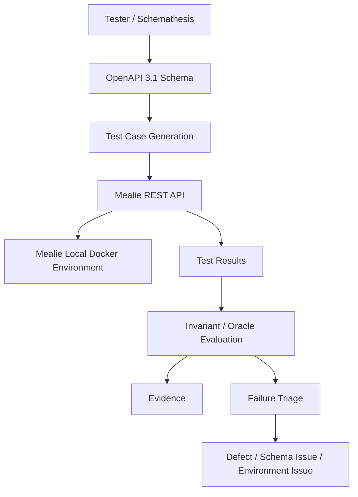

# R02-K05-Mealie-QA

> Đồ án môn **Kiểm thử phần mềm** – kiểm thử REST API của Mealie bằng phương pháp **Schema-Based API Testing / Fuzz Testing** với Schemathesis.

---

## Mục lục

- [1. Giới thiệu](#1-giới-thiệu)
- [2. Mục tiêu](#2-mục-tiêu)
- [3. System Under Test](#3-system-under-test)
- [4. Công nghệ và công cụ](#4-công-nghệ-và-công-cụ)
- [5. Thành viên và phân công](#5-thành-viên-và-phân-công)
- [6. Kiến trúc kiểm thử](#6-kiến-trúc-kiểm-thử)
- [7. Cấu trúc repository](#7-cấu-trúc-repository)
- [8. Trạng thái dự án](#8-trạng-thái-dự-án)
- [9. Phạm vi kiểm thử](#9-phạm-vi-kiểm-thử)
- [10. Chiến lược kiểm thử](#10-chiến-lược-kiểm-thử)
- [11. Business Flows](#11-business-flows)
- [12. Cài đặt và chạy Mealie](#12-cài-đặt-và-chạy-mealie)
- [13. API Documentation](#13-api-documentation)
- [14. OpenAPI Snapshot](#14-openapi-snapshot)
- [15. Schemathesis](#15-schemathesis)
- [16. Git Workflow](#16-git-workflow)
- [17. Security & Safety](#17-security--safety)
- [18. Tài liệu dự án](#18-tài-liệu-dự-án)
- [19. Tiến độ tiếp theo](#19-tiến-độ-tiếp-theo)
- [20. Ghi chú](#20-ghi-chú)

---

## 1. Giới thiệu

**R02-K05-Mealie-QA** là đồ án môn **Kiểm thử phần mềm**, kết hợp:

- **R02 – Mealie:** hệ thống quản lý công thức nấu ăn và meal planning được sử dụng làm System Under Test (SUT).
- **K05 – Schema-Based API / Fuzz Testing:** kỹ thuật kiểm thử API dựa trên API schema.
- **Schemathesis:** công cụ chính được sử dụng để sinh và thực thi các test case dựa trên OpenAPI schema.

Dự án tập trung vào việc xây dựng một quy trình kiểm thử REST API có kiểm soát và có khả năng tái lập:

```text
Mealie
   ↓
OpenAPI Schema
   ↓
API Analysis & Test Design
   ↓
Schemathesis
   ↓
Generated Test Cases
   ↓
Mealie REST API
   ↓
Test Results
   ↓
Failure Triage / Evidence / Defect Analysis
```

Toàn bộ hoạt động fuzz testing được giới hạn trong môi trường **local/lab**, không thực hiện trên hệ thống production hoặc public server.

---

## 2. Mục tiêu

Các mục tiêu chính của dự án:

1. Xây dựng môi trường Mealie local có khả năng tái lập.
2. Pin chính xác phiên bản SUT để toàn bộ thành viên sử dụng cùng một baseline.
3. Thu thập và lưu OpenAPI schema làm schema baseline.
4. Phân tích cấu trúc REST API của Mealie.
5. Xác định phạm vi API phù hợp với schema-based testing.
6. Xây dựng test scenarios, invariants và test oracles.
7. Sử dụng Schemathesis để sinh test case từ OpenAPI schema.
8. Thực hiện kiểm thử API trong phạm vi được kiểm soát.
9. Thu thập evidence và phân tích các failure được phát hiện.
10. Phân biệt API defect, schema issue, environment issue và false positive.
11. Đảm bảo quy trình kiểm thử có thể được tái lập trên môi trường khác.
12. Tổng hợp kết quả phục vụ báo cáo và trình bày môn học.

---

## 3. System Under Test

System Under Test của dự án là **Mealie**.

| Thuộc tính | Giá trị |
|---|---|
| SUT | Mealie |
| Release | `v3.28.0` |
| Pinned commit | `0552eaa4a80031b8572849cca0ed95d07f1be001` |
| API style | REST |
| API specification | OpenAPI |
| OpenAPI version | `3.1.0` |
| OpenAPI paths | `182` |
| API operations | `266` |
| Local host port | `9091` |
| Container port | `9000` |

Phân bố các HTTP operations trong schema baseline:

| HTTP Method | Operations |
|---|---:|
| GET | 115 |
| POST | 82 |
| PUT | 36 |
| PATCH | 3 |
| DELETE | 30 |
| **Tổng** | **266** |

Phiên bản SUT được xác định bằng **Git tag + commit SHA**, không dựa duy nhất vào version string do runtime trả về.

---

## 4. Công nghệ và công cụ

| Công nghệ / Công cụ | Mục đích |
|---|---|
| Mealie | System Under Test |
| REST API | Đối tượng kiểm thử |
| OpenAPI 3.1 | API schema |
| Schemathesis | Schema-Based API / Fuzz Testing |
| Python 3.11 | Test environment |
| Docker | Chạy Mealie local |
| Docker Compose | Quản lý container |
| Git | Version control |
| GitHub | Repository, branch và Pull Request |

### Test environment hiện tại

```text
Python:       3.11.9
Schemathesis: 4.28.0
```

Schemathesis được pin trong:

```text
tests/requirements.txt
```

> Trạng thái Schemathesis POC được theo dõi riêng trong phần tiến độ. Việc cài đặt công cụ không đồng nghĩa với toàn bộ API test campaign đã hoàn thành.

---

## 5. Thành viên và phân công

| Thành viên | MSSV | Vai trò |
|---|---|---|
| Nguyễn Minh Long | 2314361 | Leader / QA Integration & Defect Owner |
| Lương Hữu Thiện | 2312753 | Platform & Environment Owner |
| Hoàng Bình Quân | 2314236 | System Analysis & Test Design Owner |
| Nguyễn Hồng Phúc Thọ | 2312758 | K05 & Test Automation Owner |

### Nguyễn Minh Long

Phụ trách:

- Điều phối tiến độ.
- QA integration.
- Review kết quả kiểm thử.
- Failure triage.
- Defect management.
- Theo dõi evidence.
- Hỗ trợ tổng hợp báo cáo.

### Lương Hữu Thiện

Phụ trách:

- Thiết lập Mealie local.
- Docker/Docker Compose environment.
- Pin SUT version.
- API/OpenAPI availability.
- Environment documentation.
- Test data baseline.
- Troubleshooting môi trường.
- Reproducibility.

### Hoàng Bình Quân

Phụ trách:

- System analysis.
- API analysis.
- Xác định test scope.
- Business flows.
- Test scenarios.
- Invariants.
- Test oracles.

### Nguyễn Hồng Phúc Thọ

Phụ trách:

- K05 Schema-Based API Testing.
- Schemathesis environment.
- Proof-of-Concept.
- Test automation.
- Test execution.
- Thu thập kết quả kiểm thử.

---

## 6. Kiến trúc kiểm thử



Quy trình được thiết kế để schema, test scope và test oracle được xác định trước khi mở rộng sang fuzz testing có khả năng thay đổi trạng thái hệ thống.

---

## 7. Cấu trúc repository

Cấu trúc chính của repository:

```text
R02-K05-Mealie-QA/
│
├── README.md
├── .gitignore
│
├── setup/
│   ├── SETUP.md
│   ├── environment-versions.md
│   └── .env.example
│
├── schema/
│   ├── README.md
│   └── snapshots/
│       └── mealie-v3.28.0-openapi.json
│
├── docs/
│   ├── analysis/
│   │   ├── system-analysis.md
│   │   └── api-analysis.md
│   │
│   └── test-design/
│       ├── test-scope.md
│       ├── business-flows.md
│       ├── invariants-and-oracles.md
│       └── test-scenarios.md
│
└── tests/
    ├── README.md
    ├── requirements.txt
    └── schemathesis/
        └── test_p0_selection.py
```

Các thư mục dành cho evidence, reports hoặc defect artifacts có thể được bổ sung khi test execution bắt đầu tạo ra kết quả thực tế.

---

## 8. Trạng thái dự án

| Phase | Nội dung | Trạng thái |
|---|---|---|
| Phase 1 | Platform & Environment Setup | ✅ Completed |
| Phase 1 | Mealie version pinning | ✅ Completed |
| Phase 1 | OpenAPI snapshot | ✅ Completed |
| Phase 2 | System Analysis | ✅ Completed |
| Phase 2 | API Analysis | ✅ Completed |
| Phase 2 | Test Scope | ✅ Completed |
| Phase 2 | Business Flows | ✅ Completed |
| Phase 2 | Invariants & Oracles | ✅ Completed |
| Phase 2 | Test Scenarios | ✅ Completed |
| Phase 3A | Schemathesis environment | ✅ Prepared |
| Phase 3A | Offline P0 operation selection | ✅ Passed |
| Phase 3A | Runtime P0 smoke test | ✅ Completed |
| Phase 3B | Controlled P1 lifecycle testing | ✅ Completed |
| Phase 4 | Failure Triage / Defect Analysis | ✅ Completed |
| Phase 5 | Reproducibility & result consolidation | ✅ Completed |
| Phase 6 | Final Report & Demonstration | ✅ Completed |

Trạng thái chỉ được đánh dấu hoàn thành khi có implementation hoặc evidence tương ứng.

---

## 9. Phạm vi kiểm thử

### P0 – Read-only

Phase Schemathesis POC ban đầu ưu tiên các API read-only liên quan đến:

- Recipes
- Shopping Lists
- Shopping List Items
- Meal Plans

Phase 3A hiện lựa chọn **9 authenticated GET operations** thuộc các nhóm trên để thực hiện POC có giới hạn.

Mục tiêu P0:

- Xác nhận Schemathesis load được OpenAPI schema.
- Xác nhận operation filtering hoạt động.
- Xác nhận authentication hoạt động.
- Xác nhận generated request có thể gửi tới local SUT.
- Kiểm tra response bằng các oracle có cơ sở từ schema.
- Không làm thay đổi dữ liệu của SUT.

### P1 – Controlled lifecycle

P1 được thực hiện sau khi P0 ổn định.

Các test có khả năng bao gồm:

```text
CREATE
   ↓
READ
   ↓
UPDATE
   ↓
VERIFY
   ↓
DELETE
   ↓
CLEANUP VERIFY
```

Chỉ sử dụng tài nguyên QA riêng và phải có cleanup.

### Recipe lifecycle

Recipe lifecycle được giữ pending cho đến khi minimal valid request payload được xác minh từ API thực tế.

Không tự suy đoán request body chỉ từ việc schema không khai báo required fields.

### Ngoài phạm vi POC ban đầu

Initial POC không fuzz các nhóm có rủi ro hoặc side effect cao như:

- Authentication mutation
- Password/token management
- Admin operations
- Backup/maintenance
- Webhooks
- AI/import/stream operations
- File upload/assets
- Bulk operations
- Export operations
- External utilities

Các nhóm này chỉ được xem xét sau khi có test strategy riêng và môi trường kiểm soát phù hợp.

---

## 10. Chiến lược kiểm thử

Luồng kiểm thử chính:

```text
OpenAPI Snapshot
       ↓
API Analysis
       ↓
Test Scope
       ↓
Business Flows
       ↓
Invariants / Oracles
       ↓
Schemathesis
       ↓
Generated Test Cases
       ↓
Mealie Local API
       ↓
Results
       ↓
Failure Triage
       ↓
Evidence / Defect Analysis
```

### Conservative Oracle Strategy

Dự án tránh suy diễn behavior mà OpenAPI schema không đảm bảo.

Các oracle ban đầu tập trung vào:

- HTTP status/schema đã được API contract khai báo.
- Response body phù hợp với schema.
- Input không hợp lệ không được gây ra unexpected server-side `5xx`.
- Resource do controlled lifecycle scenario tạo phải được cleanup.

Không mặc định khẳng định behavior của:

- `401 Unauthorized`
- `403 Forbidden`
- `404 Not Found`
- ownership
- persistence semantics
- isolation
- idempotency
- rollback

nếu schema hoặc API evidence chưa đủ để chứng minh.

---

## 11. Business Flows

Các business flow ban đầu bao gồm:

### Flow 1 – QA data read flow

```text
QA Recipe
    ↓
Shopping List
    ↓
Meal Plan
```

Được sử dụng để xác minh khả năng đọc các tài nguyên QA đã chuẩn bị.

### Flow 2 – Shopping List lifecycle

```text
Create Shopping List
        ↓
Add / Manage Item
        ↓
Read / Verify
        ↓
Delete
        ↓
Cleanup Verification
```

Chỉ được kích hoạt trong P1.

### Flow 3 – Meal Plan lifecycle

```text
Create Meal Plan
       ↓
Read / Verify
       ↓
Update
       ↓
Delete
       ↓
Cleanup Verification
```

Chỉ được kích hoạt trong P1.

### Flow 4 – Recipe lifecycle

Chỉ sử dụng recipe được tạo riêng cho test.

Scenario này hiện chưa được đưa vào POC đầu tiên cho đến khi minimal valid create request được xác minh từ API thực tế.

---

## 12. Cài đặt và chạy Mealie

### Yêu cầu

Máy cần có:

- Git
- Docker
- Docker Compose

### Clone Mealie

```bash
git clone https://github.com/mealie-recipes/mealie.git
cd mealie
```

Checkout đúng baseline:

```bash
git checkout v3.28.0
git rev-parse HEAD
```

Commit phải là:

```text
0552eaa4a80031b8572849cca0ed95d07f1be001
```

### Windows

Khi build trên Windows cần chú ý line endings của shell scripts.

Repository setup đã ghi lại vấn đề CRLF/LF và cách xử lý tương ứng.

Xem hướng dẫn đầy đủ:

[setup/SETUP.md](setup/SETUP.md)

### Khởi động

Sau khi môi trường đã được chuẩn bị:

```bash
docker compose up -d
```

Kiểm tra:

```bash
docker compose ps
```

Container Mealie cần đạt trạng thái healthy trước khi chạy API test.

---

## 13. API Documentation

Sau khi Mealie local chạy thành công:

| Resource | Local URL |
|---|---|
| Mealie UI | `http://localhost:9091` |
| Swagger UI | `http://localhost:9091/docs` |
| ReDoc | `http://localhost:9091/redoc` |
| OpenAPI Schema | `http://localhost:9091/openapi.json` |
| Application information | `http://localhost:9091/api/app/about` |

Các địa chỉ trên là **localhost của máy đang chạy Mealie**, không phải public test server.

Có thể kiểm tra nhanh trên PowerShell:

```powershell
(Invoke-WebRequest http://localhost:9091/api/app/about -UseBasicParsing).StatusCode
(Invoke-WebRequest http://localhost:9091/openapi.json -UseBasicParsing).StatusCode
```

Kết quả mong đợi khi runtime hoạt động:

```text
200
200
```

---

## 14. OpenAPI Snapshot

Schema baseline được lưu tại:

```text
schema/snapshots/mealie-v3.28.0-openapi.json
```

Thông tin snapshot:

```text
OpenAPI:    3.1.0
Paths:      182
Operations: 266
```

Snapshot cho phép:

- Phân tích API mà không phụ thuộc hoàn toàn vào runtime.
- Giữ API contract baseline ổn định.
- So sánh thay đổi schema.
- Thực hiện offline analysis.
- Hỗ trợ reproducibility.
- Chuẩn bị Schemathesis testing trước khi kết nối SUT.

Runtime schema:

```text
http://localhost:9091/openapi.json
```

Snapshot và runtime schema được phân biệt rõ để tránh phụ thuộc không cần thiết vào trạng thái container.

---

## 15. Schemathesis

Schemathesis được sử dụng cho **K05 – Schema-Based API / Fuzz Testing**.

### Environment hiện tại

```text
Python:       3.11.9
Schemathesis: 4.28.0
OpenAPI:      3.1.0
```

Dependencies được pin trong:

```text
tests/requirements.txt
```

### Authentication

Authenticated testing không hardcode token trong source code.

Token được cung cấp thông qua environment variable:

```text
MEALIE_API_TOKEN
```

Ví dụ PowerShell:

```powershell
$env:MEALIE_API_TOKEN="<local-token>"
```

Không ghi token thật vào repository.

### P0 POC

POC ban đầu:

- Chỉ read-only operations.
- Giới hạn số lượng generated examples.
- Chạy trên local Mealie.
- Không chạy destructive operation.
- Không thực hiện auth-negative campaign.
- Không fuzz public server.

Chi tiết:

[tests/README.md](tests/README.md)

---

## 16. Git Workflow

Các branch được tổ chức theo loại công việc:

```text
main
setup/*
docs/*
test/*
fix/*
report/*
```

Workflow:

```text
main
  ↓
Create Feature Branch
  ↓
Implement / Document
  ↓
Validate
  ↓
Commit
  ↓
Push
  ↓
Pull Request
  ↓
Review
  ↓
Merge
  ↓
main
```

Không thực hiện development trực tiếp trên `main` khi các thành viên đang làm việc song song.

Commit message cần mô tả rõ thay đổi, ví dụ:

```text
docs: add Mealie API analysis and test design
test: add Schemathesis P0 proof of concept
fix: correct P0 operation selection
```

---

## 17. Security & Safety

Dự án tuân thủ các nguyên tắc:

### Không commit secrets

Không đưa vào Git:

- Password
- API token
- API key
- Session token
- Private credentials
- Secret configuration

`.env.example` chỉ chứa placeholder.

### Local-only fuzzing

Schema-based/fuzz testing chỉ chạy trên:

```text
localhost
```

hoặc môi trường lab được phép.

Không fuzz:

- Public Mealie instances
- Production server
- Hệ thống không thuộc phạm vi project
- Server không có quyền kiểm thử

### Test data

Ưu tiên sử dụng dữ liệu QA riêng.

Không sử dụng dữ liệu thật nếu không cần thiết.

### Controlled writes

Mọi test tạo hoặc thay đổi resource phải:

1. Chỉ tác động resource QA.
2. Theo dõi resource đã tạo.
3. Cleanup sau khi test.
4. Xác minh cleanup khi phù hợp.

---

## 18. Tài liệu dự án

### Environment

- [Setup Guide](setup/SETUP.md)
- [Environment Versions](setup/environment-versions.md)
- [Environment Example](setup/.env.example)

### Schema

- [Schema Documentation](schema/README.md)
- [Mealie v3.28.0 OpenAPI Snapshot](schema/snapshots/mealie-v3.28.0-openapi.json)

### System Analysis

- [System Analysis](docs/analysis/system-analysis.md)
- [API Analysis](docs/analysis/api-analysis.md)

### Test Design

- [Test Scope](docs/test-design/test-scope.md)
- [Business Flows](docs/test-design/business-flows.md)
- [Invariants and Oracles](docs/test-design/invariants-and-oracles.md)
- [Test Scenarios](docs/test-design/test-scenarios.md)

### Schemathesis

- [Test Environment and POC Guide](tests/README.md)
- [Pinned Python Dependencies](tests/requirements.txt)
- [P0 Selection Test](tests/schemathesis/test_p0_selection.py)

### Reproducibility and consolidated results

- [Reproducibility Guide](docs/reproducibility/REPRODUCIBILITY.md)
- [Test Inventory and Coverage](reports/summarized/Test-Inventory-and-Coverage.md)
- [Final Defect Summary](reports/summarized/Final-Defect-Summary.md)
- [Phase 5 Reproducibility and Results Summary](reports/summarized/Phase-5-Reproducibility-and-Results-Summary.md)

### Assignment compliance and final evidence

- [Assignment Compliance Matrix](docs/compliance/ASSIGNMENT-COMPLIANCE.md)
- [System Architecture](docs/architecture/SYSTEM-ARCHITECTURE.md)
- [Business/Data Flows](docs/architecture/BUSINESS-DATA-FLOWS.md)
- [Business Flow Evidence](reports/final/BUSINESS-FLOW-EVIDENCE.md)
- [Project Workflow Evidence](docs/project-management/PROJECT-WORKFLOW-EVIDENCE.md)
- [Peer Evaluation Template](docs/submission/PEER-EVALUATION-TEMPLATE.md)

---

## 19. Tiến độ tiếp theo

### Phase 3A – Schemathesis POC

Các bước tiếp theo:

1. Xác minh Mealie runtime healthy.
2. Xác minh API và OpenAPI runtime trả về HTTP 200.
3. Cung cấp API token thông qua local environment variable.
4. Chạy bounded Schemathesis P0 smoke test.
5. Xác nhận request thực sự được gửi đến local Mealie.
6. Thu thập evidence.
7. Kiểm tra failure nếu có.
8. Hoàn thành Gate Phase 3A.

### Phase 3B – Controlled writes

Sau khi P0 ổn định:

- Shopping List lifecycle.
- Shopping List Item lifecycle.
- Meal Plan lifecycle.
- Recipe lifecycle sau khi request payload được xác minh.
- Cleanup verification.

### Các phase sau

```text
Phase 3A
Schemathesis P0 POC
        ↓
Phase 3B
Controlled Lifecycle Testing
        ↓
Phase 4
Automation & Test Execution
        ↓
Failure Triage
        ↓
Defect / RCA / Evidence
        ↓
Phase 5
Reproducibility
        ↓
Final Report
```

---

## 20. Ghi chú

Khi Mealie được build trực tiếp từ source, runtime có thể hiển thị version:

```text
develop
```

Điều này không được sử dụng làm SUT baseline của project.

Baseline có thẩm quyền của dự án là:

```text
Mealie v3.28.0
Commit:
0552eaa4a80031b8572849cca0ed95d07f1be001
```

Mọi thành viên cần sử dụng cùng baseline để đảm bảo kết quả kiểm thử có khả năng tái lập.

---

## Project Status

**Current focus:** Project complete – final submission review

```text
Environment        ██████████  Completed
API Analysis       ██████████  Completed
Test Design        ██████████  Completed
Schemathesis POC   ██████████  Completed
P1 Testing         ██████████  Completed
Triage/Defects     ██████████  Completed
Reproducibility    ██████████  Completed
Final Report       ██████████  Completed
```
