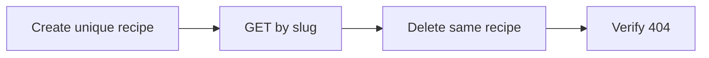
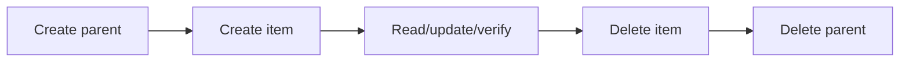
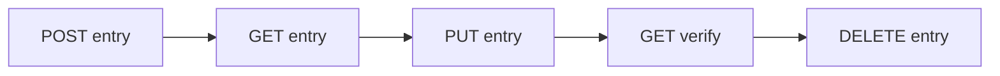

# Business / Data Flows

## FLOW-01 Recipe lifecycle

Actor: QA harness. Precondition: local authenticated QA context. Input: unique valid recipe name. Sequence: POST recipe → GET by returned slug → DELETE → GET after delete. Invariant: only created recipe is deleted; normal evidence returns 201/200/200/404. Test: `test_p1_recipe_lifecycle.py`; evidence: Phase-3-P1 summary.

## FLOW-02 Shopping List lifecycle

Actor: QA harness. Input: unique list name. Sequence: POST → GET → PUT with server representation → GET verify → DELETE → GET after delete. Cleanup deletes only the created list. Test: `test_p1_shopping_list_lifecycle.py`; evidence: Phase-3-P1 summary.

## FLOW-03 Shopping Item lifecycle

Actor: QA harness. Precondition/input: create temporary parent shopping list and item payload referencing its returned ID. Sequence: POST parent → POST item → GET → PUT → GET verify → DELETE item → DELETE parent. Cleanup child precedes parent. Test: `test_p1_shopping_item_lifecycle.py`; evidence: Phase-3-P1 summary.

## FLOW-04 Meal Plan lifecycle

Actor: QA harness. Input: controlled entry; server-returned representation supplies fields needed for update. Sequence: POST → GET → PUT → GET verify → DELETE → GET after delete. Cleanup deletes the created entry. Test: `test_p1_mealplan_lifecycle.py`; evidence: Phase-3-P1 summary.

Các flow là retained historical evidence; tài liệu không tuyên bố rerun trong compliance pass.
