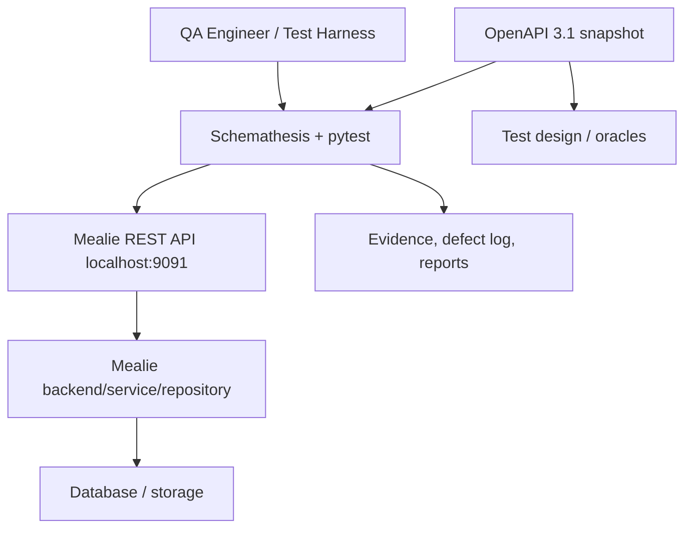

# Kiến trúc hệ thống trong phạm vi kiểm thử

## Context và boundary

Mealie chạy local tại `http://localhost:9091`. QA repository không sửa SUT; nó lưu OpenAPI snapshot, thiết kế test, pytest/Schemathesis harness, evidence và báo cáo. Database/storage là dependency phía sau Mealie; repository QA không khẳng định chi tiết triển khai hay cấu hình DB.

## Thành phần liên quan

1. **OpenAPI snapshot:** contract 3.1.0, nguồn cho P0 selection và status/schema checks.
2. **Schemathesis + pytest:** harness sinh/thi hành bounded cases; P0 GET-only và P1 directed lifecycle.
3. **Mealie REST API:** boundary duy nhất được gọi bởi tests; protected operations dùng runtime-only token.
4. **Mealie application/storage:** xử lý API và persistence; chỉ được tham chiếu ở mức RCA đã chứng minh.
5. **Evidence layer:** test summaries, defect evidence, reproducibility guide giữ claims có thể audit.

Quan hệ này hỗ trợ K05 vì schema tách contract ổn định khỏi runtime, còn harness và evidence giúp phát hiện/triage mismatch mà không cần full API coverage.
